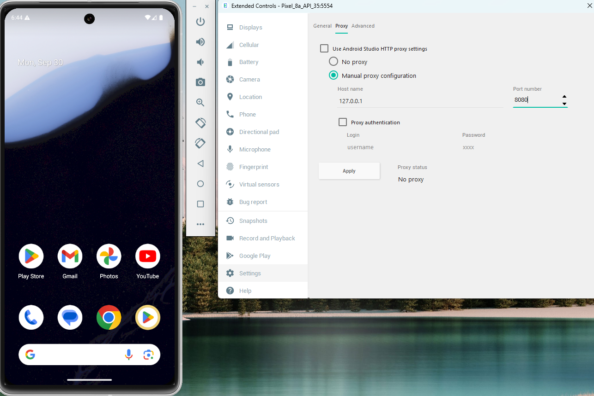

# Conduct threat modeling for a mobile app

## Resources:
- https://owasp.org/www-community/Threat_Modeling
- https://owasp.org/www-community/Threat_Modeling_Process
- https://www.hackthebox.com/blog/intro-to-mobile-pentesting
- https://owasp.org/www-project-mobile-top-10/

## Solutions:
### Proxing traffic of mobile app:
1. Install [Android Studio](https://developer.android.com/studio) to get Android Virtual Device along with Android Studio IDE.
2. Create Virtual Device 
3. Go to Settings -> Emulator -> Uncheck "launch in a tool window"
4. Install [Burp Suite](https://portswigger.net/burp/communitydownload)
5. Set up proxy interceptor -> go to "proxy" -> "proxy settings" -> change to "all interfaces" if external devices in same network, but in our case we have Android Virtual Device locally so set "loopback only" 
6. Press "import / export CA certificate" -> Export "certificate in DER format" as "burp.cer"
7. Install certificates on device -> drag cert file into emulator - file will be transfered in downloads folder -> go to "settings -> security and privacy -> more -> encryption and credentials -> install a certificate"
8. Set up proxy for [emulator networking](https://developer.android.com/studio/run/emulator-networking#proxy) . If 127.0.0.1 doesn't work, you can try to set proxy 10.0.2.2 with port 8080 in wifi (нужно это сделать только после настройки google play иначе будет ошибка `Could not sign in to accounts.google.com from android emulator`)
9. If there is no internet connection in emulator -> wipe data in device manager, configure google public dns (8.8.8.8 and 8.8.4.4), restart emulator with cold boot
10. Android Studio can be started via CLI also:
- Android SDK -> open Android Studio -> settings -> Android SDK -> SDK tools -> Check box "Android SDK Command-line tools" and press "apply" - https://developer.android.com/tools
- Open `C:\Users\Home\AppData\Local\Android\Sdk\emulator>` and start emulator from cli https://developer.android.com/studio/run/emulator-commandline:
- Also need to add environment emulator path `C:\Users%Username%\AppData\Local\Android\sdk\emulator`
- Check available emulators list: `.\emulator.exe -list-avds`
- Launch emulator with dns server set to 8.8.8.8 in order to access and login in google services (like google play) `.\emulator.exe @{YourEmulator} -dns-server 8.8.8.8` and `-http-proxy 127.0.0.1:8080`
11. Additionaly you could try use charles proxy: 
- https://www.charlesproxy.com/ - download and install
- help -> ssl proxying -> install charles root certificate -> поместить все сертификаты в следующее хранилище -> доверенные корневые центры сертификации
- proxy -> ssl proxy settings -> add -> *

### Decompiling APK
1. Sources of APK file 
2. For our example, there was decompiled APK of [ABR+ (restaurant chains)](https://www.abr.kz/)
3. `sudo apt install unzip` -> `unzip abr_3_9_4.xapk` -> here is main source file `kz.abr.android.apk`
4. Install [apktool](https://github.com/iBotPeaches/Apktool) (recompiles source to .smali) or [jadx](https://github.com/skylot/jadx) (recompiles source to .java)
5. Also, there is required to install jdk+jre (`sudo apt install openjdk-8-jre openjdk-11-jre openjdk-21-jre` -> `sudo apt-cache search openjdk`)
6. Results of found secrets in source are provided in: `./results.txt`