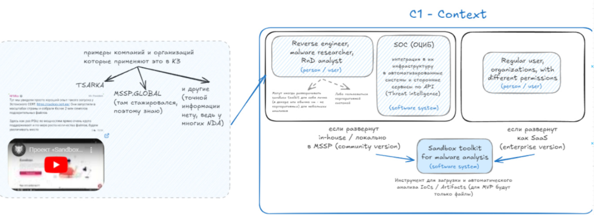
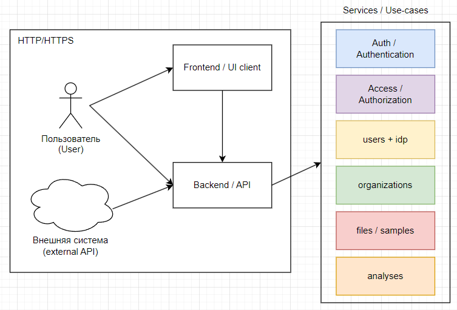
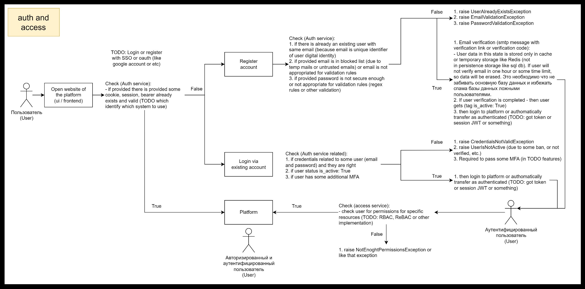
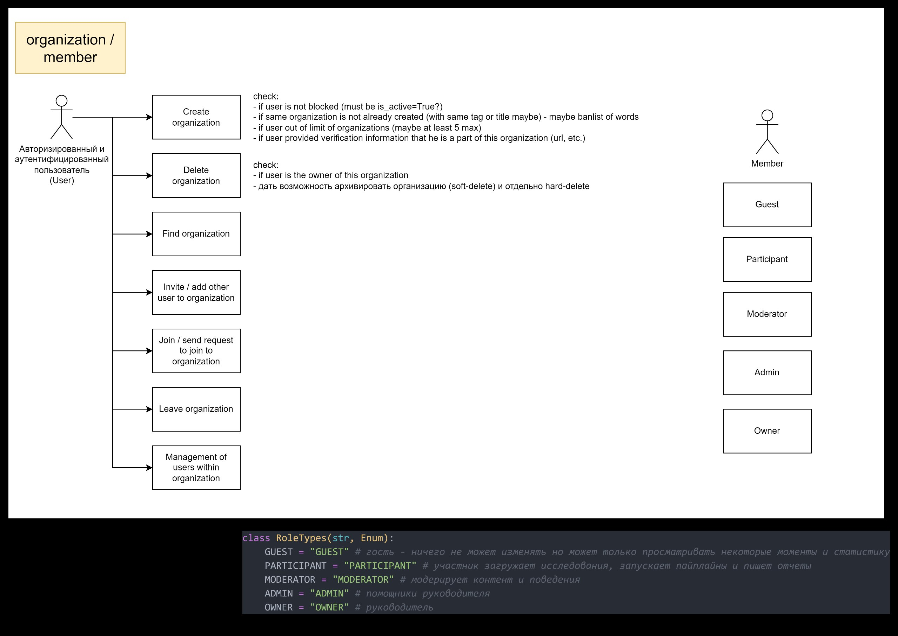
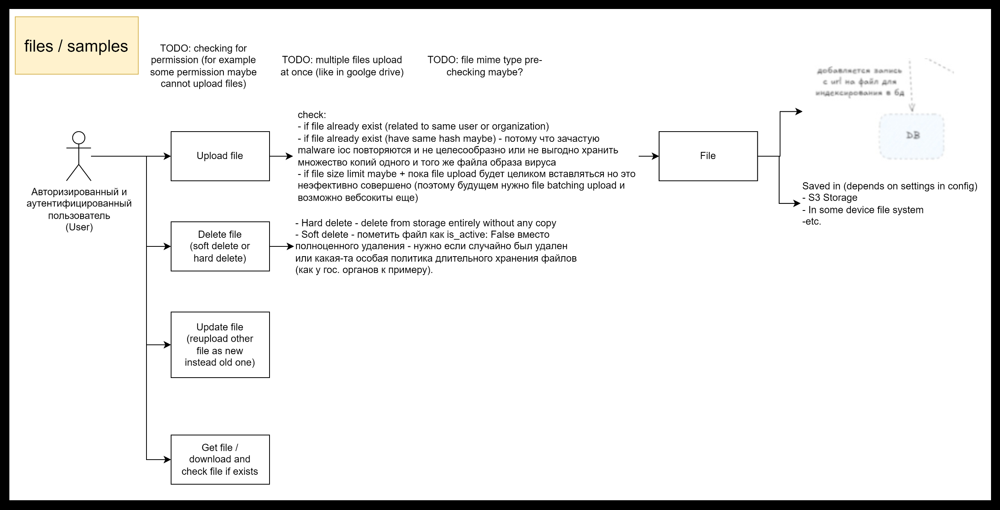
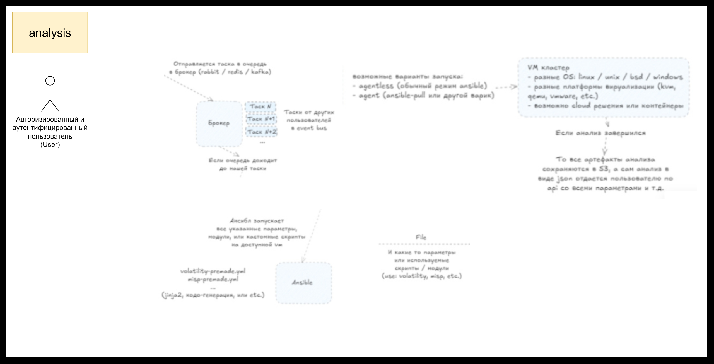

# System use cases

## System concept
**Fastsandbox** - это приложение для анализа и хранения malware-файлов. Система потенциально может применяться внутри ОЦИБ'ов (Оперативный Центров Информационной Безопасности), к примеру в Казахстане более 50+ лицензированных ОЦИБ'ов (в том числе TSARKA, MSSP, АО ГТС, и т.д.). Их задача состоит в мониторинге и анализе трафика, различных артефактов и процессов внутри сети организиций-клиентов для обеспечения превентивной ИБ защиты. На изображении 1 ниже представлен базовый контекст со стороны [C4 модели](https://c4model.com/): 

## Services aspects
На изображении 2 показан все базовые аспекты продукта 

## Use-cases / user-flow
- Auth + Access: 
- Organizations: 
- Files / Samples: 
- Analysis: 
