# Dynamic analysis

## Target
- For this assignment allowed targets is software / application (e.g. open-source, own, etc.). We chose to analyze a real one web platform - `https://bluescreen.kz/` (website), `https://t.me/bluescreenkz` (telegram group).
This is the news aggregator in Kazakhstan. This task provides an opportunity to analyze a dynamic web platform handling complex data interactions.
Its public availability, combined with potential security and privacy concerns, makes it an ideal target for testing real-time vulnerabilities
such as input validation, session management, and secure data handling. Also, it is mandotary to mention all vulnerabilities to the bugbounty platform, such as `tumar.one` and provide https://nvd.nist.gov/vuln-metrics/cvss 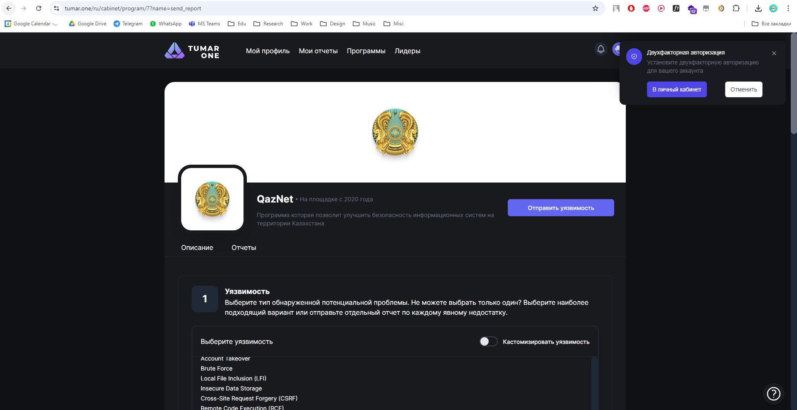 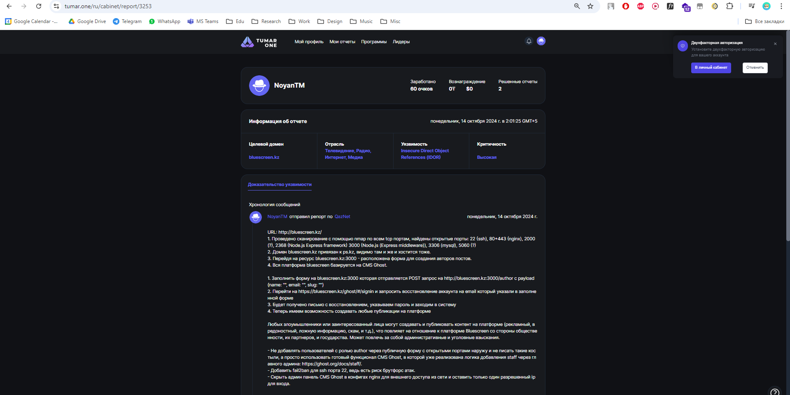

## Recon
1. `host bluescreen.kz` or `nslookup bluescreen.kz`:
    ```
    bluescreen.kz has address 91.201.214.209
    bluescreen.kz mail is handled by 0 aspmx.l.google.com.
    bluescreen.kz mail is handled by 5 alt1.aspmx.l.google.com.
    bluescreen.kz mail is handled by 10 alt3.aspmx.l.google.com.
    bluescreen.kz mail is handled by 10 alt4.aspmx.l.google.com.
    bluescreen.kz mail is handled by 5 alt2.aspmx.l.google.com.
    ```
2. `whois bluescreen.kz` | tee whois_output.txt:
   - It was found that the domain is registered via PS.KZ: ```NIC Handle.............: PS-KZ-1717161993```
3. `sudo nmap -p- -T4 -sV -O -v 91.201.214.209 -oN output.txt`:
    - `-p-` - all ports
    - `-T4` - speed of scanning
    - `-sV` - version detection of services
    - `-O` - OS detection
    - `v` - verbouse
    - `-oN output.txt` - output format and file
    ```
    PORT     STATE    SERVICE    VERSION
    22/tcp   open     ssh        OpenSSH 8.9p1 Ubuntu 3ubuntu0.10 (Ubuntu Linux; protocol 2.0)
    80/tcp   open     http       nginx 1.18.0 (Ubuntu)
    443/tcp  open     ssl/http   nginx 1.18.0 (Ubuntu)
    2000/tcp open     tcpwrapped
    2368/tcp open     http       Node.js Express framework
    3000/tcp open     http       Node.js (Express middleware)
    3306/tcp open     mysql      MySQL 8.1.0
    5060/tcp filtered sip
    ```

## Found vulnerabilites and errors
- OPENSSH (tcp port 22):
  1. List of CVEs for OpenSSH 8.9p1: https://nvd.nist.gov/vuln/search/results?form_type=Advanced&cves=on&cpe_version=cpe:/a:openbsd:openssh:8.9p1 or https://cve.mitre.org/cgi-bin/cvekey.cgi?keyword=OpenSSH+8.9p1
   - CVE-2024-6387: [explanation from offsec](https://www.offsec.com/blog/regresshion-exploit-cve-2024-6387/), [proof of concept in C](https://github.com/lflare/cve-2024-6387-poc), [proof of concept in Python](https://github.com/asterictnl-lvdw/CVE-2024-6387):
     - `gcc -o pwn-regresshion 7etsuo-regreSSHion.c`
     - `./pwn-regresshion 91.201.214.209 22`
     - Practically, working only with x32 systems
   - [metasploit framework](https://github.com/rapid7/metasploit-framework) analysis for ssh: [explanation from offsec](https://www.offsec.com/metasploit-unleashed/scanner-ssh-auxiliary-modules/), [explanation from hacktricks](https://book.hacktricks.xyz/network-services-pentesting/pentesting-ssh)
   - **Solution / recommendation**: 
     - Update openssh to the latest / stable version regularly.
  2. Risk of ssh brute attack: [seclists](https://github.com/danielmiessler/SecLists/), [wordlists](https://github.com/kkrypt0nn/wordlists), other password lists using [hydra toolkit](https://github.com/vanhauser-thc/thc-hydra): `hydra -L usernames.txt -P passwords.txt 91.201.214.209 ssh -t 4 -v -o hydra_sshbruteforce_output.txt`.
   - **Solution / recommendation**:
     - Set ssh connection via VPN only or add fail2ban to block / rate-limit specific connections.
     - Tranfser ssh to other port (security through obscurity).
- NGINX (80, 443):
   1. List of CVEs for Nginx 1.18.0: https://cve.mitre.org/cgi-bin/cvekey.cgi?keyword=Nginx+1.18.0 and hacktricks: https://book.hacktricks.xyz/network-services-pentesting/pentesting-web/nginx
   2. Incorrect redirect configuration: if you connect to `91.201.214.209` instead of domain `bluescreen.kz`, you won't be redirected to https and will be just on http
   3. Response headers with nginx version - `server: nginx/1.18.0 (Ubuntu)`
   - **Solution / recommendation**
      - Update nginx to the latest / stable version regularly.
      - Configure force redirection from http to https for every cases.
      - Hide nginx version in configs.
      - Configure WAF/IPS (nginx + cloudflare / modsecurity).
      - Configure basic auth (401 authorization required) for specific paths, like /ghost. UPD (14.10.2024) - they did it after some time of our pentest with credentials `admin:admin` - figure 0. 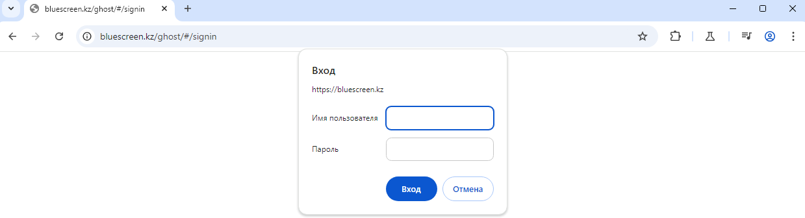
- CISCO-SCCP (2000) + SIP VoIP (5060):
   1. [Hacktricks explanation of VoIP hacking](https://book.hacktricks.xyz/network-services-pentesting/pentesting-voip)
   2. UPD (14.10.2024) - This port now closed after our pentest, so it nmap show this ports as "filtered", because they configured ufw / firewall.
- Ghost CMS (2368, 3000):
   1. NGINX не дает перейти на данный порт, ведь он перепроксируется на 80 и 443. Тут находится бэкенд и фронт часть сайта (nextjs + expressjs). Вся платформа базируется на системе [CMS Ghost](https://github.com/TryGhost/Ghost) 
   2. [Shodan показал, что версия Ghost 5.71](https://www.shodan.io/host/91.201.214.209), но это можно проверить самостоятельно in headers / html response `<meta name="generator" content="Ghost 5.71">` - https://github.com/TryGhost/Ghost/releases/tag/v5.71.0
   3. Vulnerabilities for Ghost 5.71:
      - https://github.com/RhinoSecurityLabs/CVEs/tree/master/CVE-2024-23724
      - https://rhinosecuritylabs.com/research/cve-2024-23724-ghost-cms-stored-xss/
      - https://security.snyk.io/package/npm/ghost
   4. Found [IDOR](https://portswigger.net/web-security/access-control/idor) in `bluescreen.kz:3000`, тут расположена публичная форма для создания новых авторов постов на платформе:
      - Заполнить форму на bluescreen.kz:3000 которая отправляется POST запрос на http://bluescreen.kz:3000/author с payload {name: "", email: "", slug: ""} 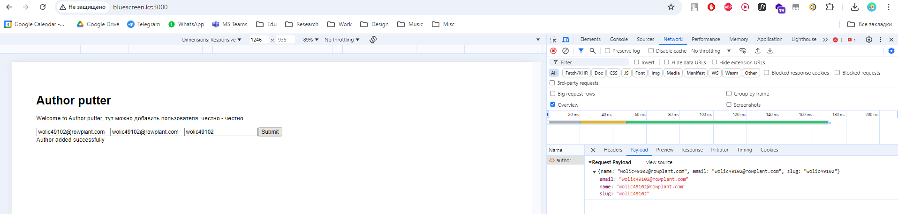 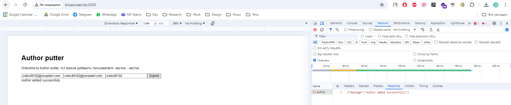
      - Перейти на `https://bluescreen.kz/ghost/#/signin` и запросить восстановление аккаунта на email который указали в заполненной форме. Желательно использовать временный email (хостинг собственного email-сервера или [temp-mail](https://temp-mail.org/en/) тот же) 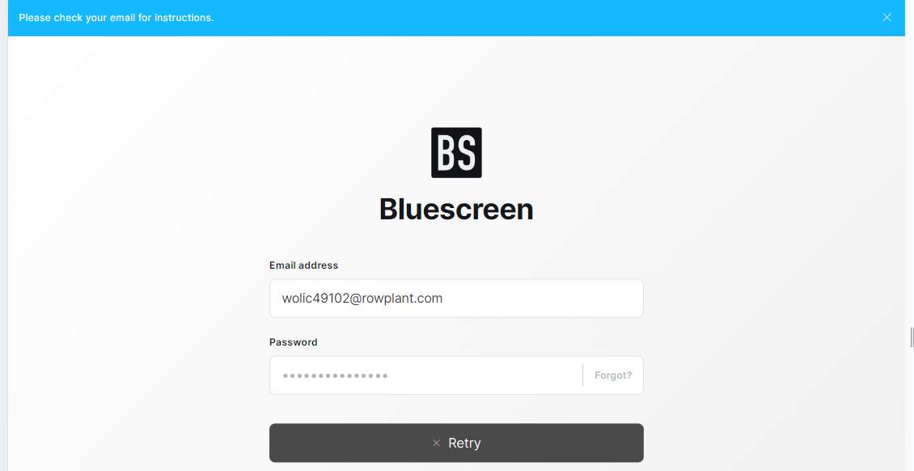 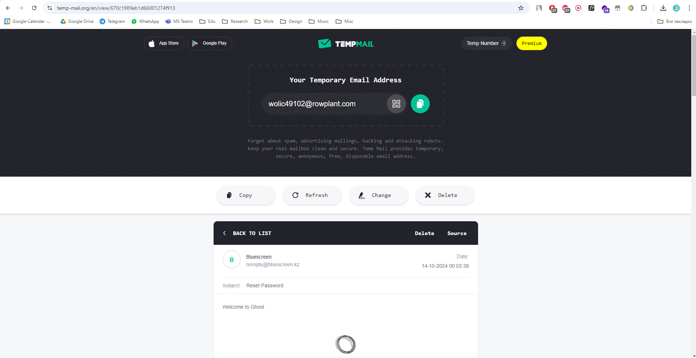
      - Будет получено письмо с url для восстановления, указываем пароль и заходим в систему 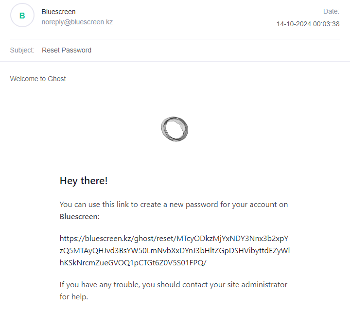 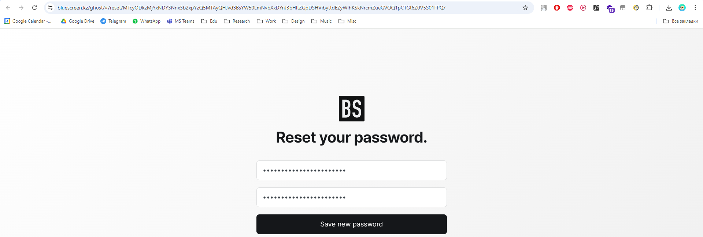
      - Теперь имеем возможность создавать любые публикации на платформе. Возникают риски, что любые злоумышленники или заинтересованный лица могут создавать и публиковать контент на платформе (рекламный, вредоностный, ложную информацию, скам, и т.д.), что повлияет на отношение к платформе Bluescreen со стороны общественности, их партнеров, и государства. Может повлечь за собой административные и уголовные взыскания. 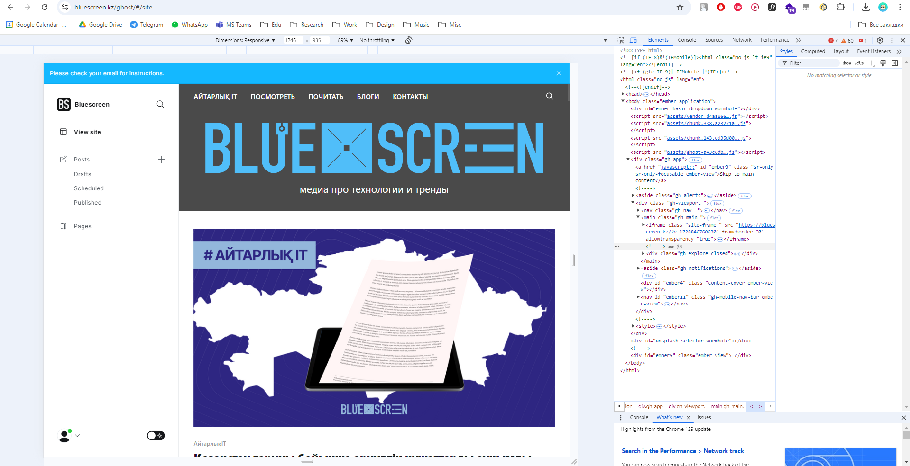 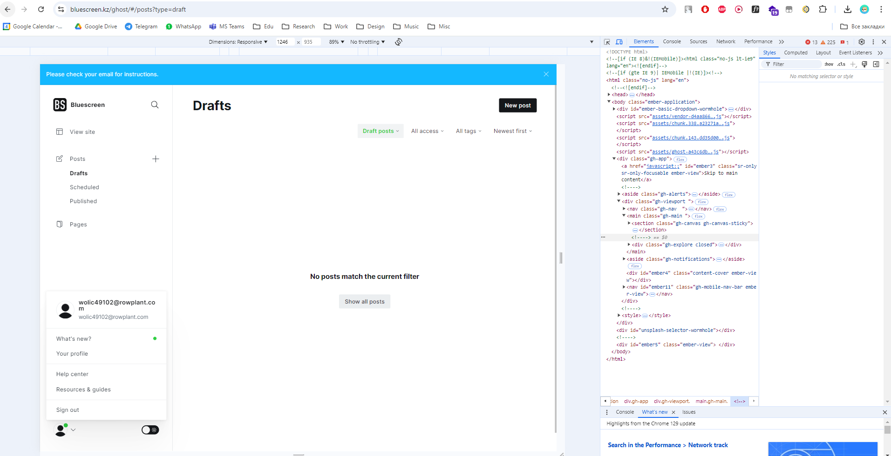 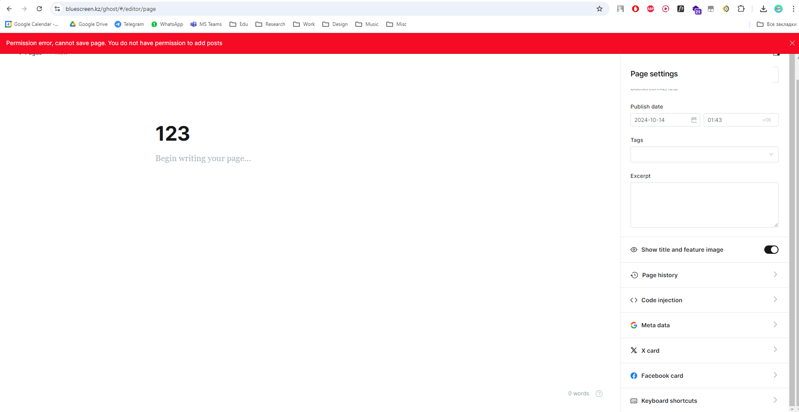 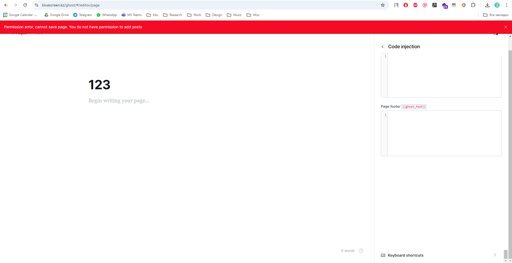 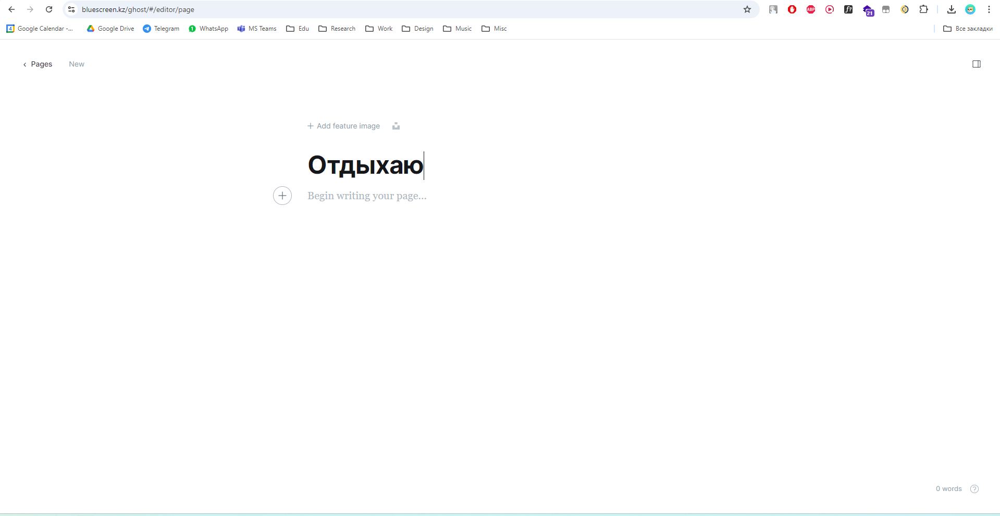 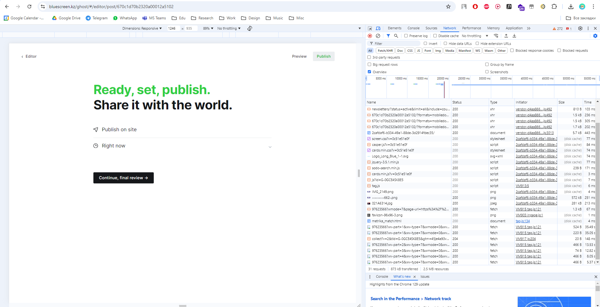 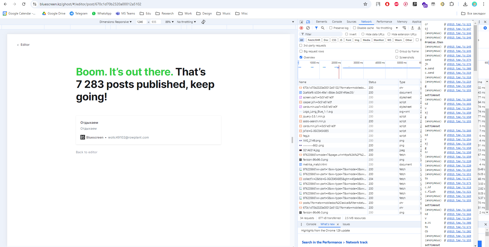 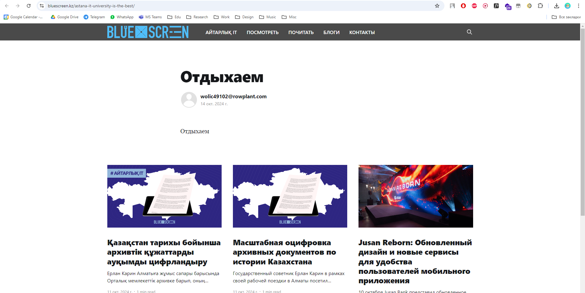 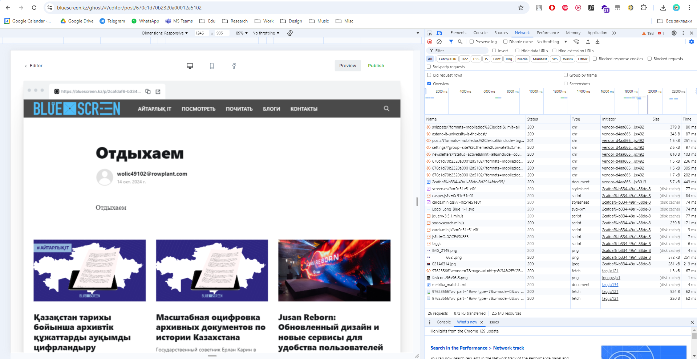 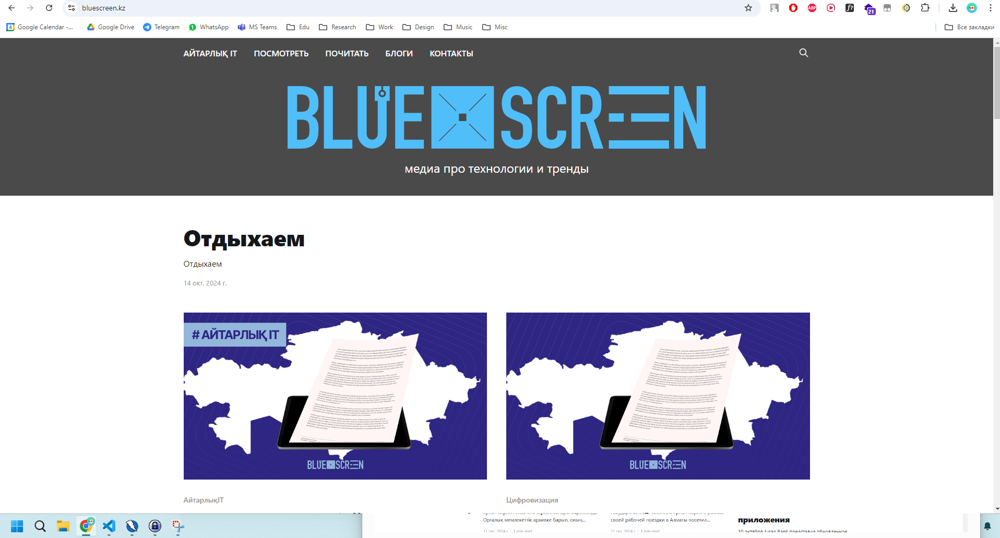 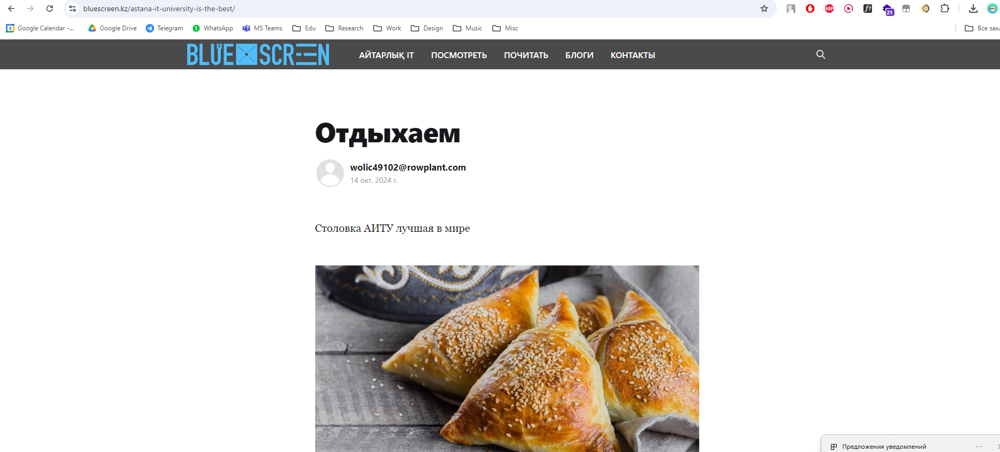
   5. OWASP ZAP or gobuster [fuzzing](https://owasp.org/www-community/Fuzzing):
      - Report results in `2024-10-14-ZAP-Report.html` 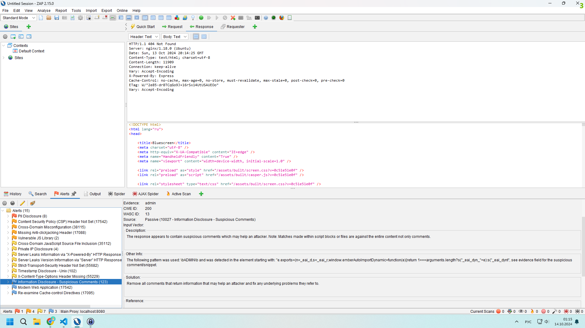
   - **Solution / recommendation**:
     - Не добавлять пользователей с ролью author через публичную форму с открытыми портами наружу и не писать такие костыли, а просто использовать готовый функционал CMS Ghost, в которой уже реализована логика добавления staff через главного админа: https://ghost.org/docs/staff/.
     - Скрыть админ панель CMS Ghost в конфигах nginx для внешнего доступа из сети и оставить только один разрешенный ip.
     - Регулярно обновлять CMS Ghost до последней или стабильной версии, желательно читать документацию чтобы не возникало различных казусов.
     - UPD (14.10.2024) - они успели скрыть ресурс на порту 3000 и настроить ufw / firewall 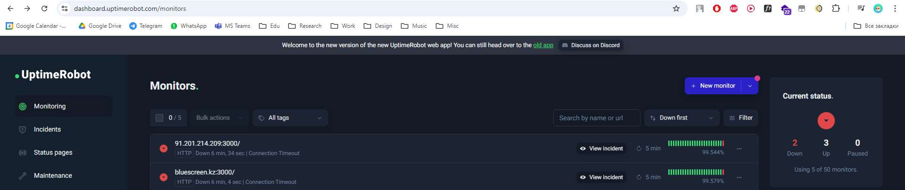
- MYSQL (3306):
   1. [CMS Ghost supported databases](https://ghost.org/docs/faq/supported-databases/)
   2. Testing for SQL injection:
      - [pentesting mysql hacktricks](https://book.hacktricks.xyz/network-services-pentesting/pentesting-mysql): postman or burp suite interceptor + [sqlmap](https://github.com/sqlmapproject/sqlmap) 
      ```
      sqlmap -r raw_http.txt --level 5 --risk 3 --time-sec=30 --threads 10 --random-agent --delay=30 --dbms mysql --output=./sqlmap --results-file=file.csv -v 3 --banner --tamper=between,bluecoat,charencode,charunicodeencode,concat2concatws,equaltolike,greatest,halfversionedmorekeywords,ifnull2ifisnull,modsecurityversioned,modsecurityzeroversioned,multiplespaces,percentage,randomcase,space2comment,space2hash,space2morehash,space2mysqldash,space2plus,space2randomblank,unionalltounion,unmagicquotes,versionedkeywords,versionedmorekeywords,xforwardedfor
      ```
